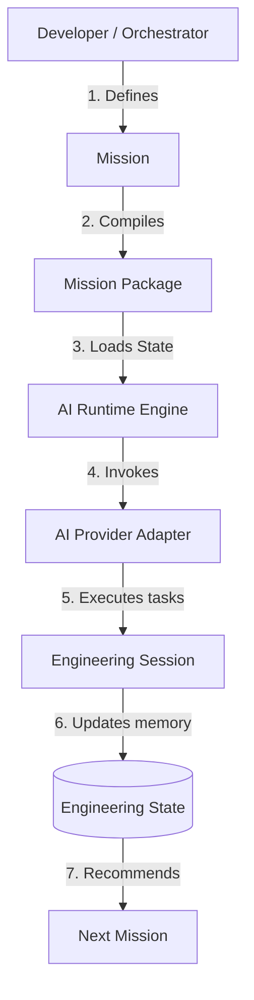

# FlowForge

> **Engineering First. AI Second.**
>
> An Engineering Operating System for AI-assisted software development.

---

## 1. What is FlowForge?

FlowForge adalah **Engineering Operating System (EOS)** yang mengorkestrasi seluruh siklus hidup rekayasa perangkat lunak dalam kolaborasi dengan agen kecerdasan buatan (AI). FlowForge memindahkan kendali konteks rekayasa dari riwayat percakapan (*chat history*) model AI ke repositori kode Anda sendiri. 

Dalam arsitektur FlowForge, AI bertindak sebagai *execution worker* pelaksana tugas rekayasa, sementara FlowForge mengelola kelangsungan status proyek (*engineering continuity*), persetujuan keputusan arsitektural (*human-in-the-loop*), dan penyimpanan riwayat rekayasa jangka panjang yang permanen.

---

## 2. Why FlowForge?

Alat bantu AI koding tradisional (seperti chat assistants atau autocomplete plugins) memiliki kelemahan mendasar: mereka bertumpu pada riwayat obrolan instan yang mudah hilang, bias, dan terbatas dalam kapasitas context window. 

FlowForge menyelesaikan masalah ini dengan memperkenalkan **Engineering State** dan **Engineering Session** sebagai fondasi kebenaran proyek.

| Karakteristik | Traditional AI Coding Assistants | FlowForge (Engineering OS) |
|---|---|---|
| **Sumber Kebenaran** | Riwayat Chat / Conversation History | Engineering State (`ENGINEERING_STATE.yaml`) |
| **Keterikatan Vendor** | Terikat pada LLM/UI tertentu | Independen (Plug-and-play AI Provider) |
| **Jejak Audit** | Tersebar di obrolan chat | Immutable Sesi Log (`session_<id>.yaml`) |
| **Penyimpanan State** | Volatile (hilang saat restart chat) | Persisten langsung di dalam Git repository |
| **Kolaborasi Multi-AI**| Mustahil tanpa input manual ulang | Mulus menggunakan context serah terima (*handover*) |

---

## 3. Core Principles

*   **Mission-Driven Engineering**: Rekayasa perangkat lunak dibagi menjadi unit kerja diskrit bernama **Mission**.
*   **Engineering State as the Source of Truth**: Akumulasi memori rekayasa jangka panjang proyek disimpan dalam repositori sebagai data deklaratif yang provider-independent.
*   **Provider Independence**: AI Provider diposisikan sebagai plugin yang dapat ditukar kapan saja (Claude, Gemini, Ollama lokal, dsb.) tanpa merusak engine orkestrasi inti.
*   **Vendor-Neutral Mission Packages**: Seluruh instruksi rekayasa dikompilasi menjadi paket tugas mandiri yang bebas dari bias instruksi prompt vendor LLM.
*   **Clean Architecture**: Kode inti FlowForge dipisahkan secara tegas dengan pola Ports & Adapters untuk menjamin modularitas sistem.

---

## 4. Core Architecture

Alur eksekusi kanonikal di dalam FlowForge Core berjalan secara stateless sebagai berikut:



---

## 5. Core Components

FlowForge Core terdiri dari 6 komponen stabil berikut:

1.  **Mission**: Unit deklaratif siklus hidup rekayasa (terbagi atas status: `BACKLOG`, `ACTIVE`, `COMPLETED`).
2.  **Mission Package**: Paket instruksi vendor-neutral hasil kompilasi Misi lengkap dengan referensi keputusan (ADR) dan arsitektur proyek.
3.  **Engineering State**: Memori rekayasa jangka panjang yang merekam riwayat misi, blocker, keputusan arsitektur, dan timeline kronologis proyek di dalam file `engineering/ENGINEERING_STATE.yaml`.
4.  **Engineering Session**: Log jejak audit detail instan dari satu eksekusi AI Provider yang dikunci secara permanen (*immutable*) setelah selesai.
5.  **Provider**: Lapisan abstraksi driver/adapter AI yang bertugas murni mengeksekusi rekayasa.
6.  **Runtime**: Engine orkestrasi stateless yang mengoordinasikan pipa eksekusi secara end-to-end.

---

## 6. Installation

FlowForge membutuhkan manajemen dependensi Python modern menggunakan **`uv`**.

1.  **Clone Repositori**:
    ```bash
    git clone https://github.com/adityabriananto/flowforge.git
    cd flowforge
    ```
2.  **Install Dependensi & Virtual Environment**:
    ```bash
    uv sync
    ```

---

## 7. Quick Start

Jalankan pipa rekayasa perdana Anda dengan langkah-langkah CLI berikut:

```bash
# 1. Inisialisasi Workspace (FlowForge mendeteksi framework Anda secara cerdas)
uv run flowforge init

# 2. Buat Misi baru di backlog
uv run flowforge mission new "Implement database connection pooling" --desc "Setup SQLAlchemy pool size"

# 3. Compile Misi menjadi Mission Package
uv run flowforge compile PROJECT-001

# 4. Eksekusi Misi menggunakan AI Runtime Provider
uv run flowforge run PROJECT-001
```

---

## 8. Engineering Workspace

Setelah inisialisasi, FlowForge mengelola struktur direktori standar berikut secara otomatis:

```
engineering/
├── missions/
│   ├── backlog/       # Misi yang sedang direncanakan
│   ├── active/        # Misi yang sedang berjalan
│   ├── completed/     # Misi yang telah selesai
│   └── templates/     # Template dokumen (adr, rfc, sprint)
├── rfcs/              # Dokumen RFC proyek
├── adrs/              # Dokumen keputusan arsitektur (ADR)
├── decisions/         # File panduan core AGENTS.md
└── ENGINEERING_STATE.yaml  # Memori jangka panjang proyek (Source of Truth)
```

Sesi eksekusi runtime disimpan secara terisolasi di bawah log rahasia:
```
.flowforge/
└── logs/
    └── session_<uuid>.yaml  # Log audit immutable per-eksekusi
```

---

## 9. Provider Model

Penyedia kecerdasan buatan dapat didaftarkan secara deklaratif di bawah file konfigurasi `providers.yaml` di root proyek:

```yaml
providers:
  - name: "Claude"
    enabled: true
    command: "uv run python agents/coder.py"
    health_command: "curl -I https://api.anthropic.com/v1/messages"

  - name: "Ollama"
    enabled: true
    command: "ollama run qwen2.5-coder:7b"
    health_command: "curl -I http://localhost:11434"
```

---

## 10. CLI Reference

*   `flowforge init`: Menginisialisasi Engineering Workspace standar, mendeteksi framework (Laravel, Django, React, Vue, SpringBoot, Node), dan menginstall template.
*   `flowforge compile <MISSION_FILE_OR_CODE>`: Mengompilasi file misi menjadi Mission Package vendor-agnostic.
*   `flowforge run <MISSION_CODE>`: Mengeksekusi satu langkah misi rekayasa secara otonom menggunakan provider default yang aktif.
*   `flowforge mission new <TITLE>`: Membuat berkas misi baru di folder backlog.
*   `flowforge mission list`: Menampilkan seluruh daftar misi terdaftar dikelompokkan berdasarkan state.
*   `flowforge doctor`: Mendiagnosis status kesehatan dependensi sistem dan workspace Anda.

---

## 11. Product Roadmap

Fokus pengembangan FlowForge ke depan berorientasi pada ekosistem DX dan kegunaan praktis:

*   **Developer Experience (DX)**: Visual editor dan VSCode Extension untuk memantau status instansi langsung dari editor.
*   **CLI Improvements**: CLI interaktif dan prompt completion.
*   **Dashboard & Monitoring**: UI dashboard real-time yang memvisualisasikan data Engineering State dan timeline log sesi.
*   **Provider Packs**: Bundle adapter default siap pakai untuk Claude, OpenAI, dan Ollama lokal.
*   **Analytics**: Analisis durasi, biaya token, dan efisiensi eksekusi antar provider.

---

## 12. Contributing

Kontribusi sangat terbuka! Harap pastikan setiap Pull Request yang dikirimkan mematuhi:
1.  **Clean Architecture**: Isolasi port dan adapter.
2.  **SOLID**: Desain kelas terfokus dengan tanggung jawab tunggal.
3.  **Provider Independence**: Kode core tidak boleh berasumsi atau mengimpor pustaka vendor AI secara langsung.

---

## 13. License

FlowForge didistribusikan di bawah lisensi MIT. Lihat file [LICENSE](LICENSE) untuk detail lengkap.
