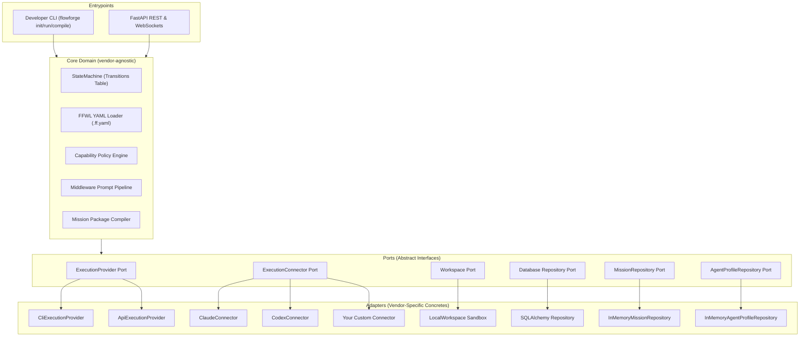

# FlowForge 🛠️

[](https://github.com/adityabriananto/flowforge)
[](https://opensource.org/licenses/MIT)

**FlowForge** is a vendor-agnostic **Engineering Runtime** for orchestrating **Human Workers**, **AI Workers**, and **System Workers** through event-driven state machines, policy engines, sandboxed execution providers, and mission-driven compilers.

> FlowForge is **not** an AI wrapper. AI is just one type of worker.  
> If every AI vendor disappeared tomorrow, FlowForge would still function — because what it orchestrates is **engineering workflows**, not AI prompts.

---

## 🎯 Core Philosophy

> *"The future of software engineering isn't just writing prompts. It is the coordinated collaboration of humans, automated systems, and AI models working together in structured workflows."*

### What Makes FlowForge Different

| Traditional AI Orchestrators | FlowForge |
|------------------------------|-----------|
| Tightly coupled to specific AI APIs | **Zero vendor references** in Core — AI is just an adapter |
| Break when providers change APIs | Core only knows: Worker, Execution, Artifact, Job, State, Policy, Event |
| Limited to AI-only workflows | Orchestrates Docker, Terraform, Playwright, Jira, Slack, Kubernetes — anything |
| Require code changes for new providers | `pip install flowforge-provider-X` → auto-discovered, zero code changes |

### The Core Knows Nothing About AI

If you open `flowforge/ports/`, `flowforge/domain/`, or `flowforge/services/`, you will find **zero** references to Claude, OpenAI, GPT, Gemini, Anthropic, or any vendor-specific term. The core only speaks in abstractions:

```
Worker → ExecutionConnector → ExecutionProvider → Artifact → Event
```

Vendor-specific implementations (Claude, Codex, Bedrock, etc.) live exclusively in `adapters/` — the outermost ring of the Hexagonal Architecture. This means:

- ✅ **Add a new AI provider**: Create an adapter + YAML profile. Zero core changes.
- ✅ **Add a non-AI worker** (Docker, Terraform): Create an adapter. Zero core changes.
- ✅ **Remove all AI providers**: Core keeps running with system and human workers.

---

## ✨ Key Features (v1.3)

- 📝 **FlowForge Workflow Language (FFWL)**: Define state configurations, transitions, and roles declaratively using strict `.ff.yaml` specifications.
- 🎯 **Mission-Driven Engineering (New)**: Define targets using strict Mission YAML (Skema v1). Manage lifecycle through strongly typed `MissionState` Enum: `BACKLOG`, `READY`, `ACTIVE`, `REVIEW`, `DONE`, `ARCHIVED`.
- 👥 **Agent Profile System (New)**: Vendor-agnostic AI agent abstraction (`AgentProfile`). Describe capabilities, limitations, and execution modes (`api`, `cli`, `agentic`, `interactive`, `batch`) via configuration files.
- ⚙️ **Mission Package Compiler (New)**: Compile Mission parameters, Agent Profiles, rules (`AGENTS.md`), references, and active workspace contexts into a single, compact, and structured `MissionPackage` intermediate artifact.
- ⚙️ **Capability Policy Engine**: Dynamically routes tasks using strategy policies (`quality-first` vs `cost-first`) with weighted scoring loaded from YAML profiles.
- 🔗 **Middleware-based Prompt Pipeline**: Resolves prompts via a pipeline chain (`Loader ➔ Transformer ➔ Validator ➔ Renderer`). Third-party plugins can register custom stages.
- 📦 **Workspace Sandbox Isolation**: Modifications are isolated by cloning repositories into temporary workspaces before auto-staging and committing changes to `flowforge/JOB-<id>` branches.
- 🤖 **Structured JSON Worker Outputs**: Evaluations use structured JSON (`result.json` containing metrics, duration, token usage, and artifacts) instead of relying solely on OS exit codes.
- 🧩 **Zero-Config Plugin Auto-Discovery**: Auto-registers external execution providers and connectors via Python `entry_points` (`flowforge.providers`).
- 💻 **Developer Experience CLI**: Standalone tools (`init`, `run`, `doctor`, `replay`, `compile`) for console-based workflow execution.
- 📊 **Real-time Glassmorphism Dashboard**: Monitor transitions and live execution metrics via WebSocket sync.
- 🔒 **Vendor-Agnostic Core**: Ports, domain, and services contain zero references to any AI vendor.

---

## 🏗️ Hexagonal Architecture



---

## 🚀 Installation

```bash
# Clone the repository
git clone git@github.com:adityabriananto/flowforge.git
cd flowforge

# Install package with dependencies locally
pip install .
```

---

## 📖 How to Use

### 1. Initialize a New Project
Generate project structures, starter configs, and execution provider profiles:

```bash
flowforge init
```
This generates:
```
├── providers/
│   ├── claude.yaml       # Provider capability & cost profile
│   └── gemini.yaml       # Provider capability & cost profile
└── workflow.ff.yaml      # Declarative FFWL YAML specification
```

### 2. Define a Mission (`mission.yaml`)
Define engineering targets in a declarative Mission YAML (v1):

```yaml
version: "1"
id: "FF-014"
title: "Implement database query optimizer"
description: "Optimize slow database read operations."
status: "READY"
priority: "high"
deliverables:
  - "Query logs and optimized indices"
definition_of_done:
  - "UT coverage > 85%"
```

### 3. Compile a Mission Package
Compile the Mission, Agent Profile, and project context into a vendor-agnostic intermediate package:

```bash
# Compile mission using specific agent profile
flowforge compile mission.yaml --profile agent_profiles/claude.yaml
```
This compiles context from your workspace files, active sprint metadata, and `AGENTS.md` rules into a unified intermediate package `mission_package_<id>.yaml`.

### 4. Configure Your Workflow (`workflow.ff.yaml`)
Define your states, roles, and allowed event transitions:

```yaml
name: "Autonomous Engineering Pipeline"
version: "1.2.0"
initial_state: "CODING"

roles:
  architect:
    capability: "architecture"
    policy: "quality-first"
  coder:
    capability: "coding"
    policy: "cost-first"

states:
  CODING:
    name: "Coding Session"
    worker_type: "subprocess"
    script: "agents/coder.py"
  TESTING:
    name: "Automated QA Suite"
    worker_type: "subprocess"
    script: "agents/run_tests.py"
  APPROVAL:
    name: "Human Review Gate"
    require_human: true
    on_approve: "DEPLOY"
    on_reject: "CODING"
  DEPLOY:
    name: "System Deployment"
    worker_type: "subprocess"
    script: "agents/deploy.py"
  COMPLETED:
    name: "Success Gate"
    is_final: true

transitions:
  - { from: "CODING", event: "SUCCESS", to: "TESTING" }
  - { from: "TESTING", event: "SUCCESS", to: "APPROVAL" }
  - { from: "TESTING", event: "FAILURE", to: "CODING" }
  - { from: "DEPLOY", event: "SUCCESS", to: "COMPLETED" }
```

### 5. Diagnose Environment Health
```bash
flowforge doctor
```

### 6. Execute Workflow Locally
```bash
flowforge run workflow.ff.yaml
```

### 7. Replay Audit Logs
```bash
flowforge replay <workflow_instance_uuid>
```

---

## 🔌 Adding a Custom Execution Provider

FlowForge is designed so that adding a new provider requires **zero changes to the core**:

### Step 1: Create a Provider YAML Profile
```yaml
# providers/bedrock.yaml
name: "bedrock"
capabilities:
  reasoning: 88
  coding: 75
cost: "medium"
speed: "fast"
```

### Step 2: Create an Adapter (Optional)
```python
# In your external package: flowforge-provider-bedrock
from flowforge.ports.connector import ExecutionConnector

class BedrockConnector(ExecutionConnector):
    async def generate_text(self, prompt, system_instruction=None):
        # Your implementation here
        ...
```

### Step 3: Register via Entry Points
```toml
# pyproject.toml of your external package
[project.entry-points."flowforge.providers"]
bedrock = "flowforge_provider_bedrock:BedrockConnector"
```

After `pip install flowforge-provider-bedrock`, FlowForge auto-discovers and registers the provider. **Zero core code changes needed.**

---

## 🛠️ Local Development & Testing

### Running Tests
```bash
pip install -e .
pytest tests/
```

### Starting the Web UI & FastAPI Server

1. **Start the Backend Server**:
   ```bash
   uv run --with websockets uvicorn flowforge.entrypoints.api.main:app --host 127.0.0.1 --port 8000
   ```
2. **Start the Frontend Dashboard**:
   ```bash
   cd dashboard/
   npm install
   npm run dev
   ```
3. Open **[http://localhost:5173/](http://localhost:5173/)** to access the monitoring interface.

---

## 🗺️ Roadmap

| Version | Milestone | Status |
|---------|-----------|--------|
| v1.0 | Core Engine, Database, API, Dashboard, Git Integration, Plugin SDK | ✅ Complete |
| v1.1 | FFWL DSL, Prompt Pipeline, Memory Engine, Execution Providers, Workspace Sandbox | ✅ Complete |
| v1.2 | Policy Engine, Provider Registry, CLI Tools, Zero-Config Discovery, Vendor-Agnostic Core | ✅ Complete |
| v1.3 | Mission System, Agent Profile, Mission Package Compiler | ✅ Complete |
| v1.5 | AI Runtime (Engineering Session, Engineering State, Provider abstraction), Core Completion | ✅ Complete |
| v1.6 | Distributed Worker & Broker (Redis, Docker, Kubernetes) | 🔜 Planned |

---

## 📄 License
This project is licensed under the MIT License — see the [LICENSE](LICENSE) file for details.
