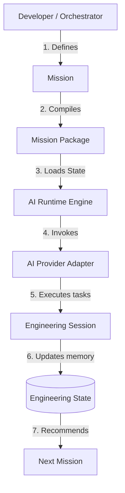

# FlowForge

> **Engineering First. AI Second.**
>
> An Engineering Operating System for AI-assisted software development.

---

## 1. What is FlowForge?

FlowForge is an **Engineering Operating System (EOS)** designed to orchestrate the entire software engineering lifecycle in collaboration with Artificial Intelligence (AI). FlowForge shifts the engineering context ownership from the transient chat histories of AI models directly into your code repository.

Under the FlowForge architecture, AI operates purely as an *execution worker* performing targeted engineering tasks, while FlowForge manages the engineering continuity, architectural decisions approval (via *human-in-the-loop* interactions), and persists long-term engineering memory.

---

## 2. Why FlowForge?

Traditional AI coding assistants (such as chat assistants or autocomplete extensions) have a fundamental flaw: they rely on conversation history which is volatile, prone to drift, and constrained by context windows.

FlowForge solves this by introducing **Engineering State** and **Engineering Session** as the persistent foundation of project truth.

| Characteristic | Traditional AI Coding Assistants | FlowForge (Engineering OS) |
|---|---|---|
| **Source of Truth** | Volatile Conversation/Chat History | Declarative Engineering State (`ENGINEERING_STATE.yaml`) |
| **Vendor Lock-in** | Bound to a specific LLM or provider UI | Decoupled (Plug-and-play AI Provider) |
| **Audit Trail** | Scattered across individual chat transcripts | Immutable Session Logs (`session_<id>.yaml`) |
| **State Persistence** | Transient (lost when the chat resets) | Persistent directly within the Git repository |
| **Multi-AI Collaboration** | Impractical without manual context-pasting | Seamless via standardized handover context |

---

## 3. Core Principles

*   **Mission-Driven Engineering**: Software engineering is decomposed into discrete, manageable units of work called **Missions**.
*   **Engineering State as the Source of Truth**: Long-term engineering memory is accumulated and stored in the repository as provider-independent declarative data.
*   **Provider Independence**: AI Providers are treated as swapable plugins (Claude, Gemini, local Ollama, etc.) without altering the core orchestration engine.
*   **Vendor-Neutral Mission Packages**: All engineering tasks and context inputs are compiled into standalone mission packages free from LLM-specific prompt biases.
*   **Clean Architecture**: The core codebase is strictly separated using the Ports & Adapters pattern to guarantee high modularity and extendability.

---

## 4. Core Architecture

The canonical end-to-end execution pipeline of FlowForge Core runs statelessly as illustrated below:



---

## 5. Core Components

FlowForge Core is composed of 6 stable, architectural domains:

1.  **Mission**: The lifecycle unit of engineering work (states: `BACKLOG`, `ACTIVE`, `COMPLETED`).
2.  **Mission Package**: A compiled, vendor-neutral bundle of instructions containing the mission details, relevant architectural decisions (ADRs), and project references.
3.  **Engineering State**: The long-term engineering memory tracking completed missions, active blockers, design decisions, and a chronological event log in `engineering/ENGINEERING_STATE.yaml`.
4.  **Engineering Session**: An immutable, detailed execution log recording the outcomes, files changed, and decisions of a single AI run.
5.  **Provider**: The abstraction layer representing the AI execution driver.
6.  **Runtime**: The stateless coordinator engine orchestrating the end-to-end execution workflow.

---

## 6. Installation

FlowForge relies on **`uv`** for modern Python package management and virtual environment execution.

1.  **Clone the Repository**:
    ```bash
    git clone https://github.com/adityabriananto/flowforge.git
    cd flowforge
    ```
2.  **Sync Dependencies**:
    ```bash
    uv sync
    ```

---

## 7. Quick Start

Execute your first automated engineering mission using the CLI:

```bash
# 1. Initialize the workspace (FlowForge auto-detects your project framework)
uv run flowforge init

# 2. Define a new mission in backlog
uv run flowforge mission new "Implement database connection pooling" --desc "Setup SQLAlchemy pool size"

# 3. Compile the mission into a Mission Package
uv run flowforge compile PROJECT-001

# 4. Run the compiled mission package using the active AI Provider
uv run flowforge run PROJECT-001
```

---

## 8. Engineering Workspace

Once initialized, FlowForge enforces a standardized directory structure in your repository:

```
engineering/
├── missions/
│   ├── backlog/       # Planned missions
│   ├── active/        # Active missions being executed
│   ├── completed/     # Successfully completed missions
│   └── templates/     # Document templates (adr, rfc, sprint)
├── rfcs/              # Project RFCs
├── adrs/              # Architecture Decision Records
├── decisions/         # Core rules (AGENTS.md)
└── ENGINEERING_STATE.yaml  # Long-term engineering memory (Source of Truth)
```

Execution logs are generated under a hidden directory to isolate transient runtime artifacts:
```
.flowforge/
└── logs/
    └── session_<uuid>.yaml  # Immutable execution audit log
```

---

## 9. Provider Model

AI execution engines can be registered declaratively in the `providers.yaml` configuration file at the repository root:

```yaml
providers:
  - name: "Claude"
    enabled: true
    command: "uv run python agents/coder.py"
    health_command: "curl -I https://api.anthropic.com/v1/messages"

  - name: "Ollama"
    enabled: true
    command: "ollama run qwen2.5-coder:7b"
    health_command: "curl -I http://localhost:11434"
```

---

## 10. CLI Reference

*   `flowforge init`: Scans the codebase to detect frameworks (Laravel, Django, React, Vue, SpringBoot, Node), initializes folders, and installs templates.
*   `flowforge compile <MISSION_FILE_OR_CODE>`: Compiles a raw mission into a vendor-agnostic Mission Package.
*   `flowforge run <MISSION_CODE>`: Executes an engineering mission package using the default active AI provider.
*   `flowforge mission new <TITLE>`: Creates a new mission template in the backlog.
*   `flowforge mission list`: Lists all workspace missions grouped by status.
*   `flowforge doctor`: Diagnoses the system requirements and verify workspace health.

---

## 11. Product Roadmap

The development roadmap focuses on DX, developer tooling, and analytical interfaces:

*   **Developer Experience (DX)**: Visual flow designer and VSCode Extension to monitor runtimes directly from your editor.
*   **CLI Improvements**: Interactive prompts and shell completions.
*   **Dashboard & Monitoring**: Real-time dashboard to visualize Engineering State timeline and audit execution sessions.
*   **Provider Packs**: Standardized, out-of-the-box CLI providers for Claude, OpenAI, and Ollama.
*   **Analytics**: Monitor token consumption, execution costs, and provider efficiency.

---

## 12. Contributing

We welcome contributions! Please ensure your Pull Requests strictly adhere to:
1.  **Clean Architecture**: Ports and adapters must remain decoupled.
2.  **SOLID**: Classes must have a single, focused responsibility.
3.  **Provider Independence**: The core engine must never directly import or depend on specific AI provider packages.

---

## 13. License

FlowForge is open-source software licensed under the MIT License. See the [LICENSE](LICENSE) file for more information.
