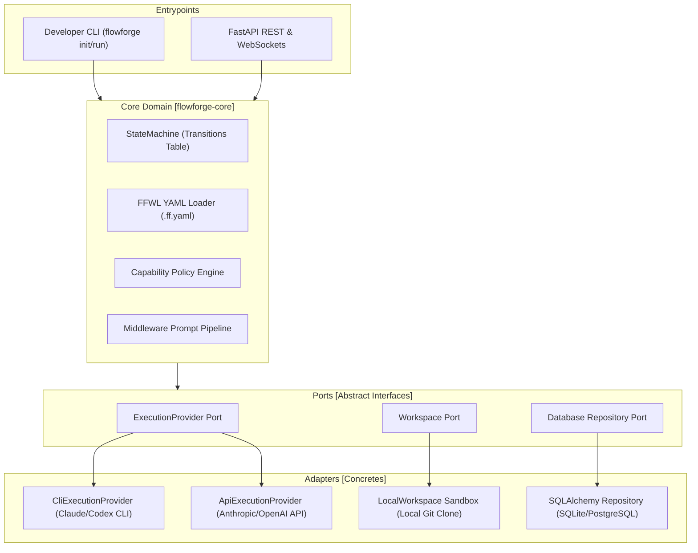

# FlowForge 🛠️

[](https://github.com/adityabriananto/flowforge)
[](https://opensource.org/licenses/MIT)

FlowForge is an **Engineering Runtime** designed to orchestrate **Human Workers**, **AI Workers**, and **System Workers** through data-driven State Machines, Policy Engines, and Event-Driven Runtimes. 

Unlike simple LLM wrappers, FlowForge abstracts LLMs and external software tools into pluggable, sandboxed, and policy-governed execution units, making it resilient, scalable, and fully decoupled from third-party vendor APIs.

---

## 🎯 Core Philosophy: What is FlowForge?

> *"The future of software engineering isn't just writing prompts. It is the coordinated collaboration of humans, automated systems, and AI models working together in structured workflows."*

FlowForge is built as a pure, lightweight, and framework-agnostic **Core** with ports and adapters (Hexagonal Architecture). If the React Dashboard is removed, FlowForge runs otonomously via CLI. If Anthropic or OpenAI change their APIs, FlowForge remains 100% operational through dynamic execution provider abstraction.

---

## ✨ Key Features (v1.2)

- 📝 **FlowForge Workflow Language (FFWL)**: Define state configurations, transitions, and roles declaratively using strict `.ff.yaml` specifications.
- ⚙️ **Capability Policy Engine**: Dynamically routes agent tasks using strategy policies (`quality-first` vs `cost-first`) and fallback prioritization loaded from YAML profiles.
- 🔗 **Middleware-based Prompt Pipeline**: Resolves prompts deterministically via a pipeline chain (`Loader ➔ Transformer ➔ Validator ➔ Renderer`) allowing third-party plugins to register custom stages.
- 📦 **Workspace Sandbox Isolation**: AI modifications are isolated by physically cloning repository dependencies into temporary workspaces before auto-staging and committing changes to `flowforge/JOB-<id>` branches.
- 🤖 **Structured JSON Worker Outputs**: Evaluations are determined by structured JSON outputs (`result.json` containing metrics, duration, token usage, and artifacts) instead of relying solely on OS exit codes.
- 🧩 **Zero-Config Plugin Auto-Discovery**: Auto-registers external LLM providers and plugin connectors via Python package `entry_points` (`flowforge.providers`).
- 💻 **Developer Experience CLI**: Standalone developer tools (`init`, `run`, `doctor`, `replay`) for console-based workflow executions.
- 📊 **Real-time Glassmorphism Dashboard**: Monitor transitions and live execution metrics (elapsed time, tokens, cost, retries) via WebSocket sync.

---

## 🏗️ Hexagonal Architecture



---

## 🚀 Installation

Install FlowForge globally in your local environment:

```bash
# Clone the repository
git clone git@github.com:adityabriananto/flowforge.git
cd flowforge

# Install package with dependencies locally
pip install .
```

---

## 📖 How to Use

### 1. Initialize a New Project
Run the `init` command to generate project structures, starter configs, and LLM provider profiles:

```bash
flowforge init
```
This generates the following structure in your current working directory:
```
├── providers/
│   ├── claude.yaml       # Claude capability & cost profile
│   └── gemini.yaml       # Gemini capability & cost profile
└── workflow.ff.yaml      # Declarative FFWL YAML specification
```

### 2. Configure Your Workflow (`workflow.ff.yaml`)
Define your states, roles, and allowed event transitions:

```yaml
name: "Autonomous Engineering Pipeline"
version: "1.2.0"
initial_state: "CODING"

roles:
  architect:
    capability: "architecture"
    policy: "quality-first"
  coder:
    capability: "coding"
    policy: "cost-first"

states:
  CODING:
    name: "AI Coding Session"
    worker_type: "subprocess"
    script: "agents/coder.py"
  TESTING:
    name: "Automated QA suite"
    worker_type: "subprocess"
    script: "agents/run_tests.py"
  COMPLETED:
    name: "Success Gate"
    is_final: true

transitions:
  - { from: "CODING", event: "SUCCESS", to: "TESTING" }
  - { from: "TESTING", event: "SUCCESS", to: "COMPLETED" }
  - { from: "TESTING", event: "FAILURE", to: "CODING" }
```

### 3. Diagnose Environment Health
Check if prerequisites (Git, SQLite database, provider profiles) are set up correctly:

```bash
flowforge doctor
```

### 4. Execute Workflow Locally
Run your FFWL YAML workflow autonomously:

```bash
flowforge run workflow.ff.yaml
```

### 5. Replay Audit Logs
Inspect previous execution transitions and costs by replaying logs:

```bash
flowforge replay <workflow_instance_uuid>
```

---

## 🛠️ Local Development & Testing

### Running Tests
Execute the comprehensive Pytest suite (covering State Machines, Repository, Prompt Pipeline, Workspace Sandbox, API, and CLI commands):

```bash
# Install development dependencies
pip install -e .

# Run pytest
pytest tests/
```

### Starting the Web UI & FastAPI Server
If you want to use the React Dashboard with real-time WebSocket state syncing:

1. **Start the Backend Server**:
   ```bash
   uv run --with websockets uvicorn flowforge.entrypoints.api.main:app --host 127.0.0.1 --port 8000
   ```
2. **Start the Frontend Dashboard**:
   ```bash
   cd dashboard/
   npm install
   npm run dev
   ```
3. Open your browser at **[http://localhost:5173/](http://localhost:5173/)** to access the premium monitoring interface.

---

## 📄 License
This project is licensed under the MIT License - see the [LICENSE](LICENSE) file for details.
