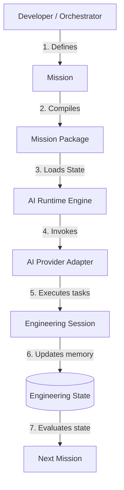

# FlowForge

> **Engineering First. AI Second.**
>
> An Engineering Operating System for AI-assisted software development.
>
> **One Engineering State. Any AI.**
>
> *AI providers may change. Your engineering process should not.*

---

## 1. What is FlowForge?

FlowForge is an **Engineering Operating System (EOS)** designed to orchestrate the entire software engineering lifecycle in collaboration with Artificial Intelligence (AI). 

Unlike traditional AI coding assistants that focus on continuous chat conversations, FlowForge manages the engineering lifecycle itself. It introduces a structured environment that abstracts LLMs into interchangeable *execution providers*, ensuring that your project's engineering memory, architecture, and history remain local, permanent, and independent of any single AI vendor.

FlowForge exists to solve the problem of context fragmentation. It ensures that the engineering knowledge accumulated during a software project is owned by the repository itself, rather than being trapped inside transient AI conversation histories.

---

## 2. Why FlowForge?

Traditional AI coding tools (such as chat assistants or autocomplete plugins) rely on volatile conversation history. This history is prone to context drift, vendor lock-in, and inevitably gets lost when starting a new session. 

FlowForge shifts the source of truth from transient chat windows to a persistent, repository-owned **Engineering State**.

| Dimension | Traditional AI Coding Assistants | FlowForge (Engineering OS) |
|---|---|---|
| **Source of Truth** | Volatile Conversation/Chat History | Declarative Engineering State (`ENGINEERING_STATE.yaml`) |
| **Execution Context** | Prompt-centric (LLM-specific prompt hacks) | Mission-centric (Vendor-neutral Mission Packages) |
| **Vendor Coupling** | Hard lock-in to specific model APIs/UIs | Decoupled (Plug-and-play AI Provider Registry) |
| **Audit Trail** | Volatile, unstructured chat transcript | Permanent, immutable Session logs (`session_<id>.yaml`) |
| **Knowledge Persistence** | Lost upon session restart | Persistent directly within the Git repository |
| **AI Handover** | Requires manual context reconstruction | Seamless transfer of completed states to next worker |

---

## 3. Design Philosophy

FlowForge is built upon the following core beliefs:

*   **Engineering belongs to the repository, not the conversation.** Chat logs are transient; your code, tests, decisions, and history should live together.
*   **Engineering knowledge should outlive AI sessions.** An engineer (human or AI) should be able to pick up where the last one left off without reading conversation transcripts.
*   **AI providers are replaceable; engineering context is not.** The algorithms generating the code will change, but the engineering standards, dependencies, and requirements of your system are continuous.

---

## 4. Core Principles

*   **Mission-Driven Engineering**: Software development is decomposed into discrete, declarative units of work called **Missions**.
*   **Engineering State as the Source of Truth**: The project's long-term memory is updated automatically as missions are started and completed.
*   **Provider Independence**: The runtime engine communicates with AI adapters through a unified port interface.
*   **Vendor-Neutral Mission Packages**: Tasks are compiled into abstract packages, separating raw requirements from vendor-specific prompt templates.
*   **Clean Architecture**: Separation of concerns via Ports & Adapters allows FlowForge to remain resilient and easily testable.

---

## 5. Core Architecture

The end-to-end execution pipeline of FlowForge Core runs statelessly as follows:



---

## 6. Core Components

FlowForge Core consists of six stable domains:

1.  **Mission**: The lifecycle unit of engineering work (states: `BACKLOG`, `ACTIVE`, `COMPLETED`).
2.  **Mission Package**: A compiled, vendor-agnostic bundle of instructions containing the mission details, relevant architectural decisions (ADRs), and project references.
3.  **Engineering State**: The long-term engineering memory tracking completed missions, active blockers, design decisions, and a chronological event log.
4.  **Engineering Session**: An immutable, detailed execution log recording the outcomes, files changed, and decisions of a single AI execution.
5.  **Provider**: The abstraction layer representing the AI execution driver.
6.  **Runtime**: The stateless coordinator engine orchestrating the end-to-end execution workflow.

---

## 7. Installation

FlowForge requires **`uv`** for modern Python package management and virtual environment execution.

### Prerequisites
- Python 3.10+
- `uv` installed (Run `pip install uv` if missing)

### Setup
1.  **Clone the Repository**:
    ```bash
    git clone https://github.com/adityabriananto/flowforge.git
    cd flowforge
    ```
2.  **Sync Dependencies**:
    ```bash
    uv sync
    ```

---

## 8. Quick Start

Verify and run your first automated engineering mission using the FlowForge CLI:

```bash
# 1. Verify the installed version
uv run flowforge --version

# 2. Diagnose environment and check prerequisites
uv run flowforge doctor

# 3. Initialize the Engineering Workspace
uv run flowforge init

# 3. Define a new mission in the backlog
uv run flowforge mission new "Implement database connection pooling" --desc "Setup SQLAlchemy pool size"

# 4. Compile the mission into a Mission Package
uv run flowforge compile PROJECT-001

# 5. Run the compiled mission package using the active AI Provider
uv run flowforge run PROJECT-001
```

---

## 9. Engineering Workspace

Once initialized, FlowForge enforces a standardized directory structure in your repository:

```
engineering/
├── missions/
│   ├── backlog/       # Planned missions
│   ├── active/        # Active missions being executed
│   ├── completed/     # Successfully completed missions
│   └── templates/     # Document templates (adr, rfc, sprint)
├── rfcs/              # Project RFCs
├── adrs/              # Architecture Decision Records
├── decisions/         # Core rules (AGENTS.md)
└── ENGINEERING_STATE.yaml  # Long-term engineering memory (Source of Truth)
```

Execution logs are generated under a hidden directory to isolate transient runtime artifacts:
```
.flowforge/
└── logs/
    └── session_<uuid>.yaml  # Immutable execution audit log
```

---

## 10. Provider Model

FlowForge is strictly provider-independent. AI execution engines (such as Claude, Codex, Gemini, or local models running via Ollama) are configured declaratively in a `providers.yaml` file at the repository root:

```yaml
providers:
  - name: "Claude"
    enabled: true
    command: "uv run python agents/coder.py"
    health_command: "curl -I https://api.anthropic.com/v1/messages"

  - name: "Ollama"
    enabled: true
    command: "ollama run qwen2.5-coder:7b"
    health_command: "curl -I http://localhost:11434"
```

The Runtime Engine executes missions through these configurations without depending on any provider-specific SDK or library.

---

## 11. CLI Reference

*   `flowforge doctor`: Diagnoses system requirements and verifies workspace health.
*   `flowforge init`: Scans the codebase to detect frameworks (Laravel, Django, React, Vue, SpringBoot, Node), initializes folders, and installs templates.
*   `flowforge mission new <TITLE>`: Creates a new mission template in the backlog.
*   `flowforge mission list`: Lists all workspace missions grouped by status.
*   `flowforge compile <MISSION_FILE_OR_CODE>`: Compiles a raw mission into a vendor-agnostic Mission Package.
*   `flowforge run <MISSION_CODE>`: Executes an engineering mission package using the default active AI provider.

---

## 12. Roadmap

FlowForge Core has reached architectural completion. 

### FlowForge v1
*   [x] **Core Complete**: Mission, Package, State, Session, Provider Registry, and Runtime Engine.

### Future Focus
*   **Developer Experience (DX)**: Interactive command CLI prompts, visualization tools, and shell completions.
*   **CLI Improvements**: Faster package compilation and smart bootstrapping enhancements.
*   **Dashboard**: A local web interface to visualize the Engineering State timeline and audit session logs.
*   **Provider Packs**: Pre-built adapter packages for major cloud and local LLMs.
*   **Integrations**: IDE extensions and Model Context Protocol (MCP) integrations.
*   **Analytics**: Metrics for tracking token costs, latency, and success rates across different providers.
*   **Documentation**: Detailed API references and guides for custom provider development.

---

## 13. Contributing

We welcome contributions! Please ensure your Pull Requests strictly adhere to:
1.  **Clean Architecture**: Ports and adapters must remain decoupled.
2.  **SOLID**: Classes must have a single, focused responsibility.
3.  **Provider Independence**: The core engine must never directly import or depend on specific AI provider packages.

---

## 14. License

FlowForge is open-source software licensed under the [MIT License](LICENSE).
