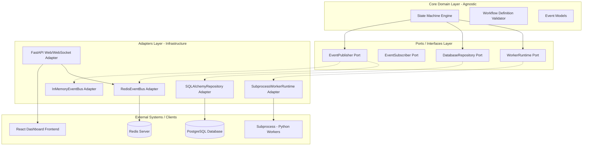

# FlowForge Architecture Diagram & Structure

Dokumen ini menjelaskan struktur arsitektur bersih (**Clean / Hexagonal Architecture**) yang diterapkan pada FlowForge.

---

## 1. Hexagonal Architecture Diagram

Berikut adalah visualisasi hubungan antara **Core Domain**, **Ports (Interfaces)**, dan **Adapters (Implementations)**:



---

## 2. Directory Layout Concept

Struktur direktori repositori `agent-interface` akan dirancang sebagai berikut di Sprint 2:

```text
agent-interface/
├── architecture/          # Architecture Decision Records (ADRs) & Diagrams
├── brd/                  # Business Requirements Documents
├── prd/                  # Product Requirements Documents
├── src/
│   ├── flowforge/
│   │   ├── __init__.py
│   │   ├── domain/        # Core Domain Layer (Agnostic)
│   │   │   ├── models.py  # Workflow, State, Event dataclasses
│   │   │   └── engine.py  # Custom State Machine Logic
│   │   ├── ports/         # Ports (Abstract Interfaces)
│   │   │   ├── database.py
│   │   │   ├── event_bus.py
│   │   │   └── worker.py
│   │   ├── adapters/      # Adapters (Implementations)
│   │   │   ├── database/  # SQLAlchemy / PostgreSQL implementation
│   │   │   ├── event/     # Redis PubSub & InMemory event bus
│   │   │   └── worker/    # Subprocess execution logic
│   │   └── entrypoints/   # Delivery / UI triggers
│   │       ├── api/       # FastAPI endpoints (HTTP + WebSockets)
│   │       └── cli.py     # CLI execution tool
│   └── tests/             # Unit & Integration Tests (QA Area)
```

---

## 3. Alur Eksekusi Transisi State (HITL Case)

1. **Worker Selesai**: Subprocess Python menyelesaikan tugasnya dan menulis output.
2. **State Transition**: `SubprocessWorkerRuntime` mengembalikan control, memicu `StateMachine` untuk beralih dari `CODING`/`TESTING` ke `AWAITING_APPROVAL`.
3. **Event Published**: `StateMachine` mempublikasikan event `StateChangedEvent` via `EventPublisher`.
4. **WebSocket Push**: Adapter `FastAPI Web/WebSocket` menerima event tersebut (dari Redis/InMemory Event Bus) dan meneruskannya ke `React Dashboard`.
5. **Human Action**: User mengklik "Approve" di React. Dashboard mengirim HTTP POST `/api/instances/{id}/approve` ke FastAPI.
6. **Trigger Transition**: FastAPI memicu transisi pada `StateMachine` untuk beralih ke state berikutnya (`COMPLETED`).
