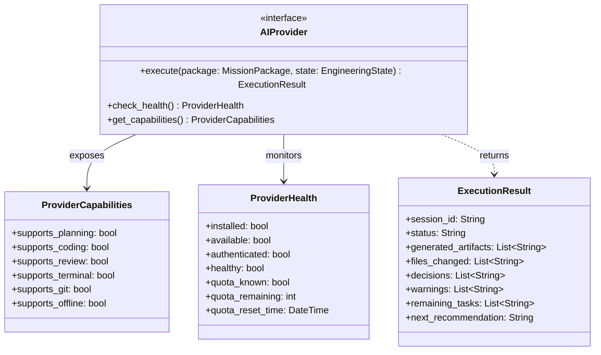

# ADR-013: Provider Abstraction and Execution Contract for AI Runtime

## Status
Accepted (Refined)

## Context
Validasi riil dari FlowForge dalam eksekusi paket rekayasa menunjukkan bahwa sistem ini telah berevolusi melebihi sekadar *Prompt Engine*. FlowForge sekarang memosisikan dirinya sebagai **Engineering Operating System** yang mengorkestrasi alur kerja rekayasa terstruktur. Oleh karena itu, antarmuka provider lama yang berbasis prompt tekstual sederhana (`execute(prompt)`) harus digantikan dengan antarmuka yang mengonsumsi kontrak eksekusi tingkat tinggi berupa `MissionPackage`.

## Decision
Kami memutuskan untuk memperbarui dan memperketat abstraksi AI Provider dengan aturan arsitektural berikut:

1.  **Mission Package as Execution Contract**: Mengubah antarmuka eksekusi `AIProvider` agar secara eksklusif menerima objek domain `MissionPackage` (`execute(mission_package)`). Prompt mentah tidak lagi menjadi satuan tugas utama di level core.
2.  **Engineering Session Lifecycle**: Setiap eksekusi AI Runtime menghasilkan instansi `EngineeringSession` terisolasi yang bertindak sebagai *handover* status kerja, keputusan, dan sisa tugas antar AI worker.
3.  **Engineering State Integration**: Memori proyek jangka panjang disimpan di dalam `EngineeringState` yang provider-independent. Runtime memperbarui `EngineeringState` setelah setiap misi selesai dijalankan.
4.  **Deterministic Capabilities**: Kapabilitas provider harus dideklarasikan secara eksplisit (misalnya: `planning`, `coding`, `review`, `terminal`, `git`, dsb.) bukan menggunakan nilai skor subjektif.
5.  **Provider Independence**: FlowForge tidak bergantung pada vendor spesifik (seperti Claude, OpenAI, Ollama, dsb.). Seluruh vendor diimplementasikan sebagai plugin eksternal yang dapat ditukar secara plug-and-play.

## Consequences
-   **Kelebihan**: Independensi AI yang mutlak. Core FlowForge tidak memiliki asumsi apa pun tentang cara kerja prompt internal provider.
-   **Kelebihan**: Integrasi *Engineering State* bertindak sebagai memori jangka panjang proyek sehingga model AI berikutnya tidak perlu memindai ulang seluruh codebase dari nol.
-   **Kelebihan**: *Engineering Session* menyediakan audit log yang kaya bagi pengembang manusia untuk melacak keputusan dan peringatan yang dikeluarkan selama pengerjaan otomatis.
