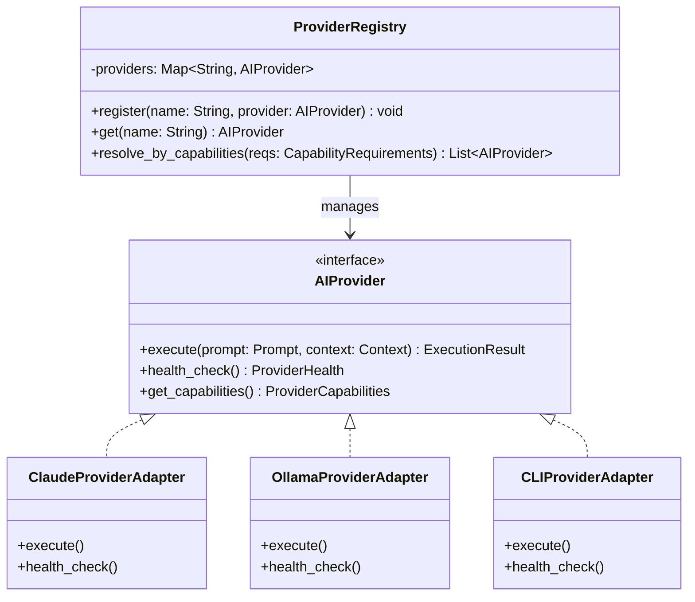

# ADR-013: Provider Abstraction for AI Runtime

## Status
Accepted

## Context
FlowForge memerlukan kemampuan orkestrasi yang tidak terikat pada vendor kecerdasan buatan tertentu (Anthropic, OpenAI, Gemini, Ollama, dsb.). Eksekusi instruksi rekayasa harus dapat dialihkan secara dinamis tergantung pada ketersediaan, biaya, efisiensi, dan kebijakan keamanan (misalnya, data sensitif harus dijalankan di LLM lokal lewat Ollama, sementara penalaran kompleks menggunakan model cloud).

## Decision
Kami memutuskan untuk menerapkan **Provider Abstraction** yang memisahkan FlowForge Core dari driver model AI dengan cara:
1.  **AIProvider Port**: Antarmuka abstrak seragam yang mendefinisikan kemampuan minimal untuk eksekusi tugas, pemeriksaan kesehatan (health check), dan kapabilitas model.
2.  **Provider Registry**: Registrasi terpusat yang menyimpan instansi provider terdaftar dan melakukan pencarian berdasarkan kapabilitas.
3.  **Dukungan Multi-Channel**: Driver/adapter provider dirancang untuk mendukung API-based, CLI-based (termasuk subproses lokal), dan local server APIs (seperti endpoint port Ollama).

## Consequences
-   **Kelebihan**: Integrasi vendor AI baru hanya memerlukan pembuatan adapter kelas baru tanpa menyentuh core orkestrator FlowForge.
-   **Kelebihan**: Transisi transparan antara model lokal (Ollama) dan API cloud (Claude/Gemini).
-   **Kekurangan**: Overhead kecil untuk konversi format prompt ke payload spesifik vendor di level adapter.
