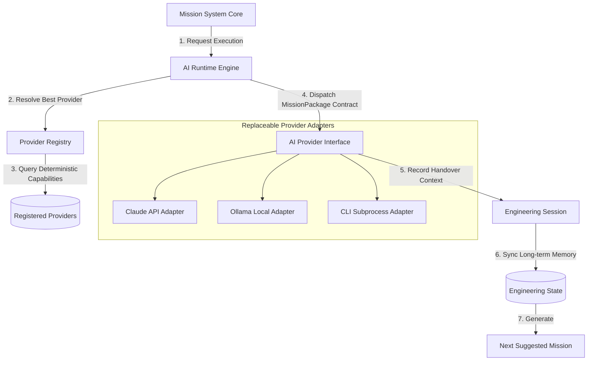
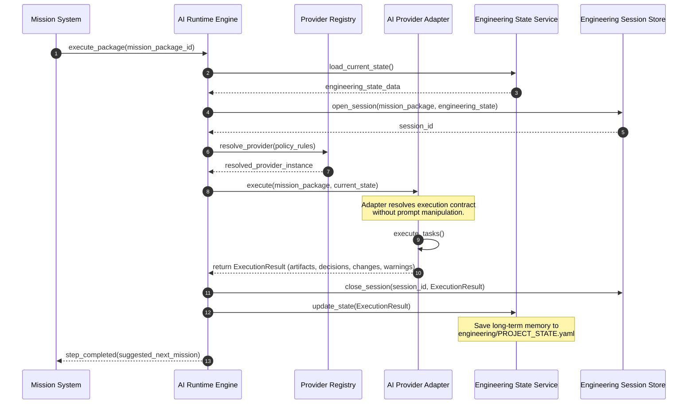

# RFC-013: AI Runtime Architecture Specification (Refined)

## 1. Abstract
Proposal ini merinci spesifikasi arsitektur AI Runtime FlowForge yang merefleksikan perannya sebagai **Engineering Operating System**. Arsitektur ini menetapkan `MissionPackage` sebagai kontrak eksekusi kanonikal tunggal dan memperkenalkan `EngineeringSession` sebagai mekanisme serah terima status kerja, sisa tugas, dan memori jangka panjang proyek melalui `EngineeringState`.

---

## 2. Updated Execution Flow
Pipa eksekusi kanonikal FlowForge berjalan sebagai berikut:

```
Mission
  ↓
Mission Package (Execution Contract)
  ↓
Provider Runtime (Registry & Coordinator)
  ↓
Provider Adapter (Claude, Gemini, Ollama, etc.)
  ↓
Engineering Session (Local Work context, Artifacts, Handover)
  ↓
Engineering State (Long-term memory integration)
  ↓
Next Mission (Suggested next task)
```

---

## 3. Component Interaction Diagram
Memperlihatkan interaksi orkestrator runtime dengan Registry, persistensi Sesi Rekayasa, dan penyimpanan Memori jangka panjang (Engineering State).



---

## 4. Sequence Diagram (Session Lifecycle & Handover Flow)
Sequence diagram ini menggambarkan bagaimana Sesi Rekayasa dijalankan dan bagaimana state disinkronkan ke dalam Engineering State pada akhir eksekusi untuk menjadi basis memori AI berikutnya.



---

## 5. Domain Model Refinements

### 5.1. Deterministic Provider Capabilities
Mengganti skor subjektif dengan deklarasi Boolean eksplisit dari fitur yang didukung secara deterministik oleh model:
```python
from dataclasses import dataclass

@dataclass
class ProviderCapabilities:
    supports_planning: bool    # Mampu memecah tugas menjadi daftar sub-tugas
    supports_coding: bool      # Mampu menulis kode implementasi
    supports_review: bool      # Mampu melakukan peninjauan/QA
    supports_terminal: bool    # Mampu mengeksekusi perintah shell lokal
    supports_git: bool         # Mampu melakukan git commit/push
    supports_search: bool      # Mampu melakukan pencarian web
    supports_image: bool       # Mampu memproses input/output gambar
    supports_offline: bool     # Dapat berjalan tanpa jaringan internet (lokal)
```

### 5.2. Provider Health & Quota Model
Pemeriksaan kesehatan mencakup pemantauan kuota penggunaan secara eksplisit tanpa estimasi:
```python
from enum import Enum
from datetime import datetime
from typing import Optional

class ProviderHealthStatus(str, Enum):
    HEALTHY = "HEALTHY"
    DEGRADED = "DEGRADED"
    OFFLINE = "OFFLINE"

@dataclass
class ProviderHealth:
    installed: bool
    available: bool
    authenticated: bool
    healthy: bool
    quota_known: bool
    quota_remaining: Optional[int] = None       # None jika tidak diketahui
    quota_reset_time: Optional[datetime] = None  # None jika tidak diketahui
    last_success: Optional[datetime] = None
    last_failure: Optional[datetime] = None
    latency_ms: int = 0
```

### 5.3. Engineering Session Model
Engineering Session bertindak sebagai konteks handover lengkap antar eksekusi AI:
```python
from dataclasses import dataclass, field
from datetime import datetime
from typing import List, Dict, Any

@dataclass
class EngineeringSession:
    session_id: str
    mission_package_id: str
    provider_name: str
    start_time: datetime = field(default_factory=datetime.utcnow)
    finish_time: Optional[datetime] = None
    generated_artifacts: List[str] = field(default_factory=list)
    files_modified: List[str] = field(default_factory=list)
    engineering_decisions: List[str] = field(default_factory=list)
    warnings: List[str] = field(default_factory=list)
    remaining_tasks: List[str] = field(default_factory=list)
    suggested_next_mission: Optional[str] = None
    handover_summary: Optional[str] = None
```

### 5.4. Engineering-Centric Execution Result Model
Hasil pemrosesan AI berfokus pada hasil rekayasa nyata:
```python
@dataclass
class ExecutionResult:
    session_id: str
    status: str                         # "SUCCESS" or "FAILURE"
    generated_artifacts: List[str]      # Daftar path berkas yang dibuat
    files_changed: List[str]            # Daftar path berkas yang dimodifikasi
    decisions: List[str]                # Keputusan desain/arsitektur yang diambil
    warnings: List[str]                 # Peringatan lint, pengujian, atau limitasi
    remaining_tasks: List[str]          # Sisa TODO list dari checklist
    next_recommendation: Optional[str]  # Usulan kode misi berikutnya (misal PROJECT-002)
    provider_metadata: Dict[str, Any]   # Informasi token, cost, latensi vendor
```

---

## 6. Provider Policy
Kebijakan pemilihan provider didasarkan pada kapabilitas dan status kepemilikan model:
```python
@dataclass
class ProviderPolicy:
    preferred_providers: List[str]  # Nama provider prioritas (misal ["Ollama", "Claude"])
    fallback_providers: List[str]   # Nama provider cadangan jika prioritas offline/degraded
    forbidden_providers: List[str]  # Nama provider yang dilarang (misal cloud APIs untuk data rahasia)
```

---

## 7. Folder Structure Proposal
Berikut adalah struktur usulan baru untuk mendukung AI Runtime Refined:

```
src/flowforge/
├── domain/
│   ├── ai_session.py             # Model EngineeringSession & ExecutionResult
│   ├── engineering_state.py      # Model memori jangka panjang proyek
│   └── provider_capabilities.py  # Model kapabilitas & kesehatan
├── ports/
│   ├── ai_provider.py            # Port AIProvider interface (mission_package-centric)
│   ├── session_repository.py     # Port persistensi sesi rekayasa
│   └── state_repository.py       # Port persistensi Engineering State
└── services/
    └── runtime/
        ├── engine.py             # Runtime Engine coordinator
        ├── registry.py           # Provider Registry & Policy filter
        └── state_manager.py      # Pemasang memori state ke backlog/active
```

---

## 8. Public Interface Definitions

### 8.1. AIProvider Port (`ports/ai_provider.py`)
```python
from abc import ABC, abstractmethod
from flowforge.domain.mission_package import MissionPackage
from flowforge.domain.provider_capabilities import ProviderCapabilities, ProviderHealth
from flowforge.domain.ai_session import ExecutionResult, EngineeringSession

class AIProvider(ABC):
    @abstractmethod
    def execute(self, package: MissionPackage, session: EngineeringSession) -> ExecutionResult:
        """Menjalankan Misi berdasarkan kontrak MissionPackage dan sesi aktif."""
        pass

    @abstractmethod
    def check_health(self) -> ProviderHealth:
        """Memeriksa kesehatan dan quota tanpa estimasi manual."""
        pass

    @abstractmethod
    def capabilities(self) -> ProviderCapabilities:
        """Mengembalikan data spesifikasi kapabilitas deterministik."""
        pass
```

### 8.2. ProviderRegistry Service (`services/runtime/registry.py`)
```python
from typing import Dict, List
from flowforge.ports.ai_provider import AIProvider
from flowforge.domain.provider_capabilities import ProviderCapabilities

class ProviderRegistry:
    def __init__(self):
        self._providers: Dict[str, AIProvider] = {}

    def register(self, name: str, provider: AIProvider) -> None:
        """Mendaftarkan instansi provider plugin."""
        self._providers[name.lower()] = provider

    def get(self, name: str) -> AIProvider:
        """Mendapatkan provider terdaftar berdasarkan nama."""
        provider = self._providers.get(name.lower())
        if not provider:
            raise KeyError(f"Provider '{name}' tidak terdaftar.")
        return provider

    def resolve_by_policy(self, required_capabilities: List[str], preferred: List[str], forbidden: List[str]) -> AIProvider:
        """Mencari provider sehat yang paling cocok berdasarkan kecocokan kapabilitas dan kebijakan."""
        # Memilih provider berdasarkan capability matrix dinamis
        for name in preferred:
            name_lower = name.lower()
            if name_lower in self._providers and name_lower not in [f.lower() for f in forbidden]:
                prov = self._providers[name_lower]
                health = prov.check_health()
                if health.healthy and health.available:
                    return prov
        # Fallback logic diletakkan di sini jika preferred tidak tersedia
        raise RuntimeError("Tidak ada provider terdaftar yang memenuhi kriteria kebijakan eksekusi.")
```
