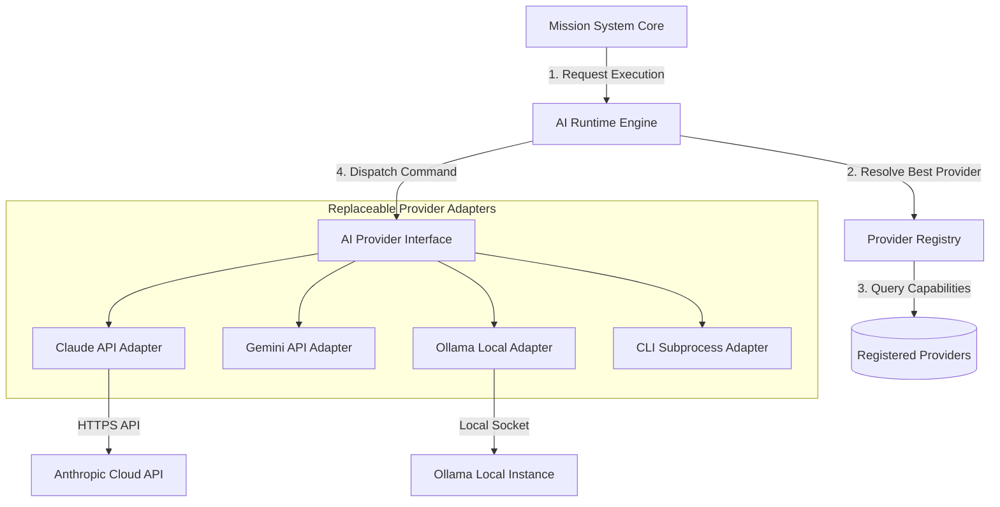
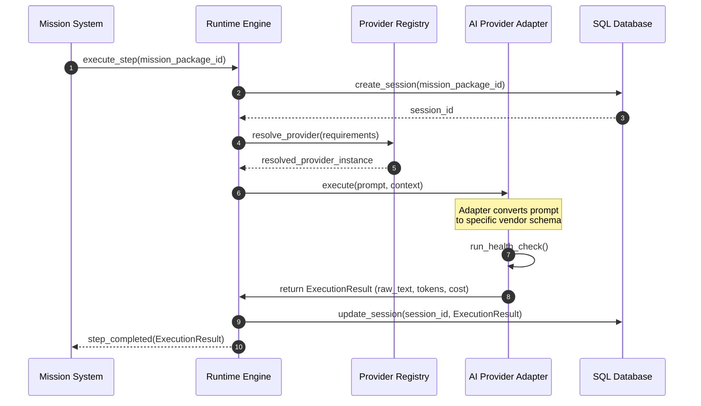

# RFC-013: AI Runtime Architecture Specification

## 1. Abstract
Proposal ini merinci spesifikasi arsitektur AI Runtime FlowForge yang vendor-agnostic. Arsitektur ini mengabstraksikan interaksi dengan model AI melalui antarmuka *adapter* terpadu, mendukung API cloud, subproses CLI lokal, dan integrasi API lokal seperti Ollama tanpa mengubah logika inti Mission System.

---

## 2. Component Interaction Diagram
Sistem orkestrasi berinteraksi dengan Registry untuk memilah Provider mana yang sesuai berdasarkan kebutuhan kapabilitas Misi.



---

## 3. Sequence Diagram (Runtime Execution Flow)
Menunjukkan bagaimana siklus hidup sesi eksekusi dijalankan dari orkestrator hingga ke AI provider.



---

## 4. Domain Model Design

### 4.1. Provider Capabilities Model
Setiap provider wajib mengekspos model kapabilitasnya secara kuantitatif maupun kualitatif:
```python
from dataclasses import dataclass, field
from typing import Dict

@dataclass
class ProviderCapabilities:
    reasoning_score: int       # Skala 1 - 100
    coding_score: int          # Skala 1 - 100
    review_score: int          # Skala 1 - 100
    context_limit: int         # Batas token konteks (misal 200000)
    supported_languages: list  # Bahasa pemrograman yang dikuasai
    cost_per_million_input: float
    cost_per_million_output: float
```

### 4.2. Provider Health Model
Status kesehatan diperbarui melalui pemeriksaan berkala (*health check*):
```python
from enum import Enum
from datetime import datetime

class ProviderHealthStatus(str, Enum):
    HEALTHY = "HEALTHY"
    DEGRADED = "DEGRADED"
    OFFLINE = "OFFLINE"

@dataclass
class ProviderHealth:
    status: ProviderHealthStatus
    latency_ms: int
    last_checked: datetime
    error_message: str | None = None
```

### 4.3. Session Lifecycle State
Setiap eksekusi AI Runtime dikelola dalam sesi terisolasi:
```python
class SessionState(str, Enum):
    INITIALIZED = "INITIALIZED"
    EXECUTING = "EXECUTING"
    COMPLETED = "COMPLETED"
    FAILED = "FAILED"
    PAUSED = "PAUSED"
```

### 4.4. Execution Result Model
Format terpadu hasil pemrosesan AI:
```python
@dataclass
class ExecutionResult:
    session_id: str
    status: str             # "SUCCESS" or "FAILURE"
    output_text: str
    input_tokens: int
    output_tokens: int
    execution_cost: float   # Dihitung secara real-time berdasarkan tarif provider
    duration_ms: int
```

---

## 5. Folder Structure Proposal
Berikut usulan perluasan direktori di `src/flowforge/` untuk menampung komponen runtime baru:

```
src/flowforge/
├── domain/
│   ├── ai_session.py             # Model siklus sesi runtime
│   └── provider_capabilities.py  # Model kapabilitas & kesehatan
├── ports/
│   ├── ai_provider.py            # Abstract port AIProvider
│   └── session_repository.py     # Port persistence sesi runtime
├── adapters/
│   └── ai_provider/              # Semua driver/adapter runtime
│       ├── __init__.py
│       ├── claude_adapter.py     # Implementasi Anthropic
│       ├── ollama_adapter.py     # Implementasi Ollama Lokal
│       └── cli_adapter.py        # Implementasi Subproses CLI
└── services/
    └── runtime/
        ├── engine.py             # Engine eksekusi & session manager
        └── registry.py           # Resolver & registry provider
```

---

## 6. Public Interface Definitions

### 6.1. AIProvider Port (`ports/ai_provider.py`)
```python
from abc import ABC, abstractmethod
from flowforge.domain.provider_capabilities import ProviderCapabilities, ProviderHealth
from flowforge.domain.ai_session import ExecutionResult

class AIProvider(ABC):
    @abstractmethod
    def execute(self, prompt: str, system_instruction: str | None = None) -> ExecutionResult:
        """Menjalankan instruksi prompt ke model AI."""
        pass

    @abstractmethod
    def check_health(self) -> ProviderHealth:
        """Memeriksa kesehatan dan latensi koneksi ke provider."""
        pass

    @abstractmethod
    def capabilities(self) -> ProviderCapabilities:
        """Mengembalikan data spesifikasi dan kapabilitas model."""
        pass
```

### 6.2. ProviderRegistry Service (`services/runtime/registry.py`)
```python
from typing import Dict, List
from flowforge.ports.ai_provider import AIProvider

class ProviderRegistry:
    def __init__(self):
        self._providers: Dict[str, AIProvider] = {}

    def register(self, name: str, provider: AIProvider) -> None:
        """Mendaftarkan driver provider baru."""
        self._providers[name.lower()] = provider

    def get(self, name: str) -> AIProvider:
        """Mendapatkan provider terdaftar berdasarkan nama."""
        provider = self._providers.get(name.lower())
        if not provider:
            raise KeyError(f"Provider '{name}' tidak terdaftar.")
        return provider

    def resolve_best_provider(self, coding_weight: int, speed_priority: bool) -> AIProvider:
        """Memilih provider terbaik yang sehat berdasarkan kriteria kapabilitas."""
        best_provider = None
        # Implementasi algoritma seleksi kapabilitas diletakkan di sini
        return best_provider
```
